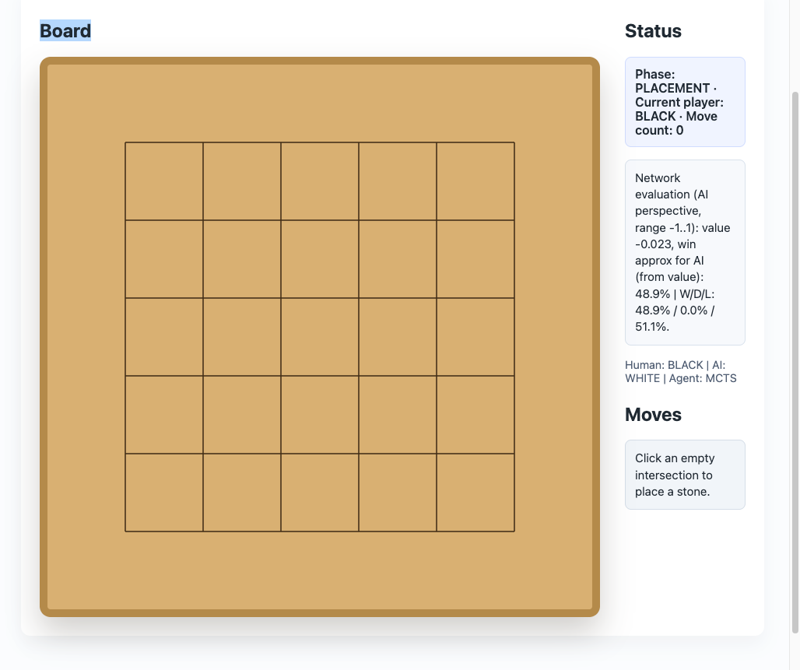
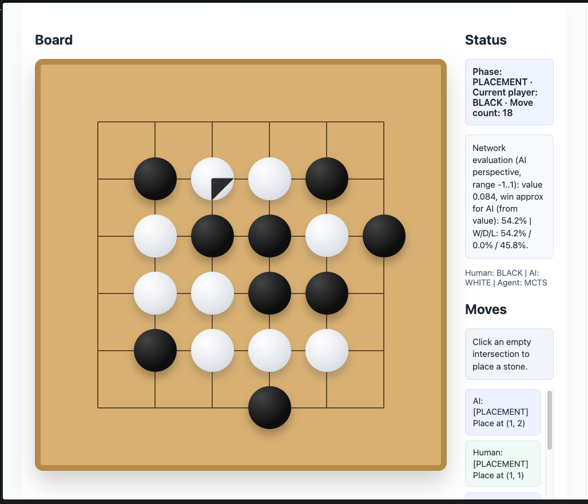
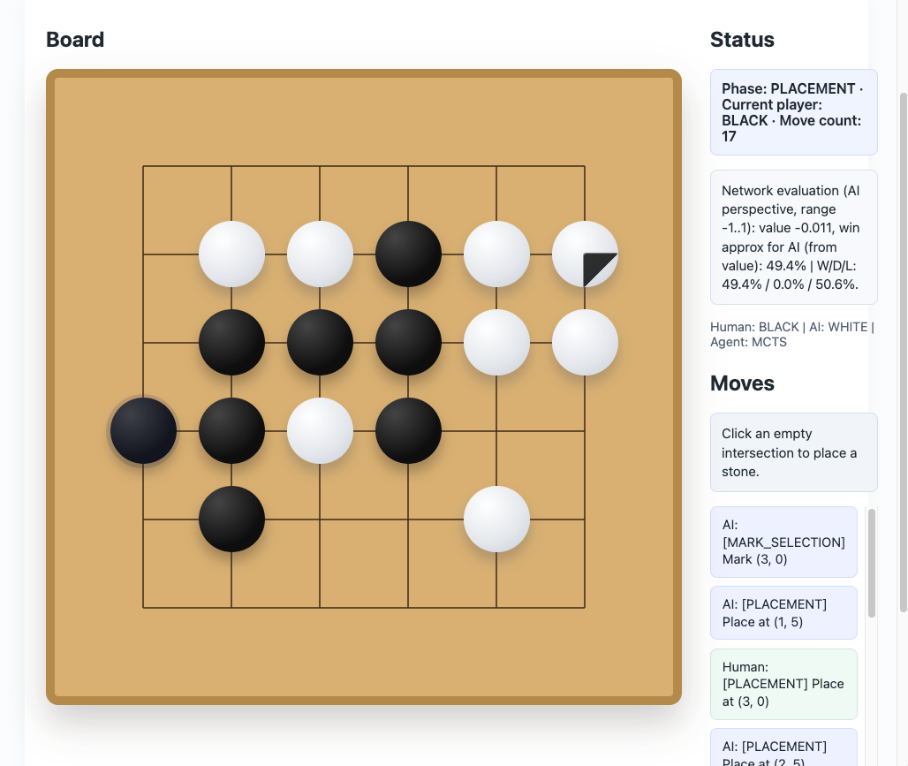
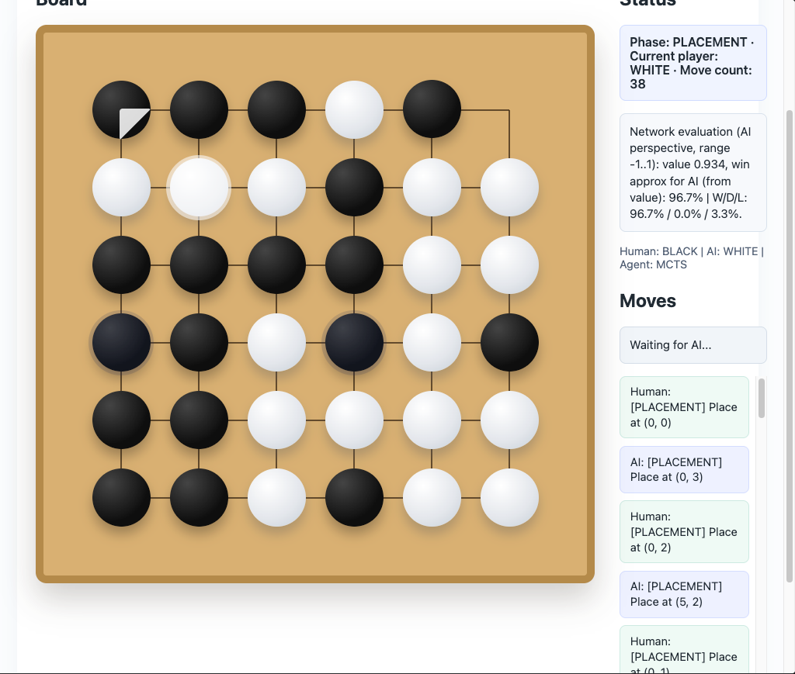
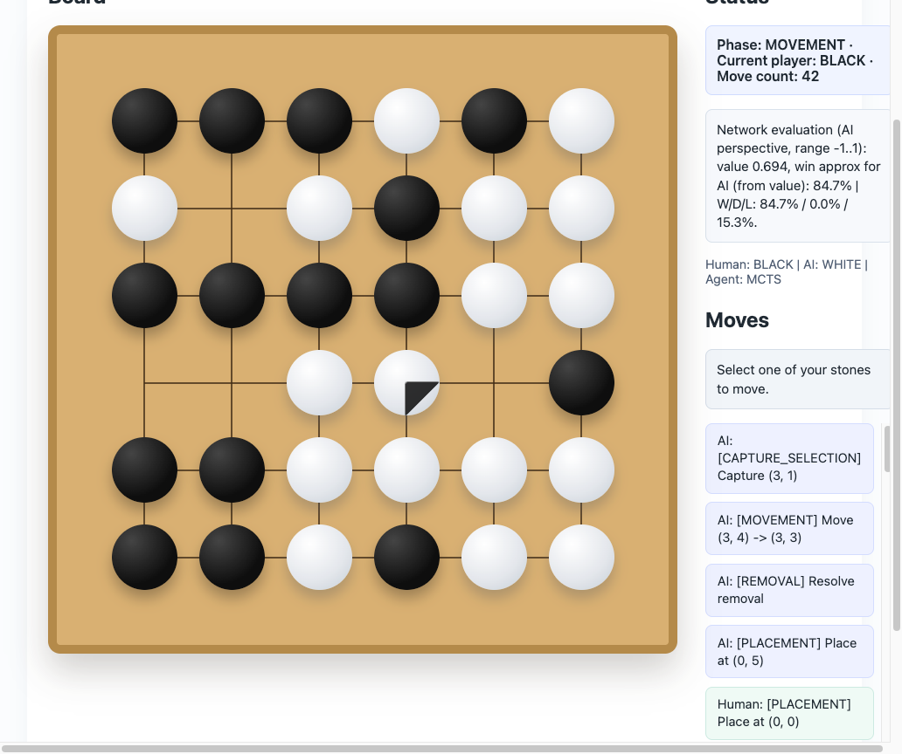
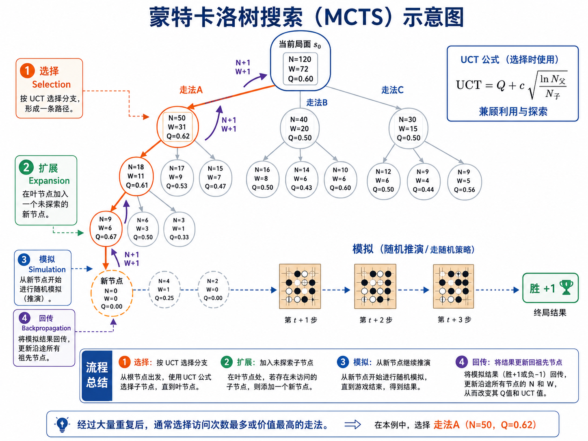

<!-- _class: lead -->
<!-- _paginate: false -->
<!-- _footer: "" -->

<div class="eyebrow">ProjShare</div>

# 让 AI 学会下六洲棋

<div class="subtitle">从规则、完整树搜索到自博弈训练：程序怎样一步步学会做选择</div>

<div class="byline">汇报人：张存远　·　[2026-07-24]</div>

<!--
讲述要点：
今天不从复杂算法讲起，而是先认识六洲棋，再看程序怎样一步步学会做选择。
-->

---

# 目录

<div class="agenda">
  <div class="agenda-row"><div class="n">01</div><b>六洲棋规则背景</b><span>初始棋盘、四阶段，以及“方/洲”</span></div>
  <div class="agenda-row"><div class="n">02</div><b>完整 MCTS</b><span>是什么、为什么需要，以及怎样选择路线</span></div>
  <div class="agenda-row"><div class="n">03</div><b>策略符号与训练逻辑</b><span>s、p、v、π、z 分别是什么</span></div>
  <div class="agenda-row"><div class="n">04</div><b>PUCT</b><span>如何兼顾已有证据与继续探索</span></div>
  <div class="agenda-row"><div class="n">05</div><b>代码与训练闭环</b><span>伪代码、真实实现和网络结构</span></div>
</div>

<!--
讲述要点：
先保留必要的规则介绍。算法主线是：MCTS 先建立搜索框架，再定义符号，随后解释 PUCT，最后落到代码与训练实现。
-->

---

# 01｜什么是六洲棋？

<figure class="rule-shot" style="margin:12px auto 0; max-width:600px">
  
</figure>
<!--
讲述要点：
这里只让听众先看到六洲棋的初始棋盘：6×6 交叉点，开局为空。
规则动作和胜负目标留到后两页结合截图说明。
-->

---

# 六洲棋规则

<div class="stage-grid">
  <div class="stage">
    <figure class="rule-shot"></figure>
    <div class="stage-copy"><b>① 落子</b><span>双方轮流把棋子放到空位，直到棋盘填满。</span></div>
  </div>
  <div class="stage">
    <figure class="rule-shot"></figure>
    <div class="stage-copy"><b>② 形成“方/洲”后标记</b><span>落子形成方可标记 1 子；形成洲可标记 2 子。</span></div>
  </div>
  <div class="stage">
    <figure class="rule-shot"></figure>
    <div class="stage-copy"><b>③ 移除</b><span>棋盘填满后，双方所有被标记的棋子一起移除。</span></div>
  </div>
  <div class="stage">
    <figure class="rule-shot"></figure>
    <div class="stage-copy"><b>④ 走子与提吃</b><span>棋子上下左右走一格；再形成方或洲时直接提吃。</span></div>
  </div>
</div>

<!--
讲述要点：
四张图按对局顺序讲“玩家做了什么、接下来发生什么”，不逐条念规则。
-->

---

# “方”和“洲”是规则的开关

<div class="board-patterns">
  <div class="card">
    <h2>方：2 × 2 同色棋子</h2>
    <div class="mini-board">
      <span class="stone" style="left:48px; top:48px"></span>
      <span class="stone" style="left:96px; top:48px"></span>
      <span class="stone" style="left:48px; top:96px"></span>
      <span class="stone" style="left:96px; top:96px"></span>
    </div>
    <p>落子阶段：标记对方 <strong>1</strong> 子<br>走子阶段：提吃对方 <strong>1</strong> 子</p>
  </div>
  <div class="card">
    <h2>洲：一整行或一整列同色</h2>
    <div class="mini-board">
      <span class="stone w" style="left:0px; top:144px"></span>
      <span class="stone w" style="left:48px; top:144px"></span>
      <span class="stone w" style="left:96px; top:144px"></span>
      <span class="stone w" style="left:144px; top:144px"></span>
      <span class="stone w" style="left:192px; top:144px"></span>
      <span class="stone w" style="left:240px; top:144px"></span>
    </div>
    <p>落子阶段：标记对方 <strong>2</strong> 子<br>走子阶段：提吃对方 <strong>2</strong> 子</p>
  </div>
</div>

<!--
讲述要点：
“方”和“洲”解释为什么某一步会触发标记或提吃。
-->

---

# 02｜什么是 MCTS？

<div class="eyebrow">Monte Carlo Tree Search · 蒙特卡洛树搜索</div>

<div style="display:grid; gap:24px; grid-template-columns:0.72fr 1.28fr; margin-top:14px">
  <div>
    <h2>一种“边搜索、边建树”的决策算法</h2>
    <p>棋局可以画成一棵树：当前局面是根，一步棋是一条边，走完后的局面是子节点。</p>
    <div class="callout" style="margin-top:24px">不把所有可能都搜索完，而是把计算资源集中到<strong>更有希望的走法</strong>上，通过反复试走判断哪一步更好。</div>
    <p class="small" style="margin-top:18px"><strong>核心循环：</strong>选择 → 扩展 → 模拟 / 评估 → 回传</p>
  </div>
  <figure class="rule-shot" style="align-self:start; margin:0 auto; max-width:590px">
    
  </figure>
</div>

<!--
讲述要点：
MCTS 全称 Monte Carlo Tree Search。
可以把它比作棋手在脑中反复试下：表现好的路线多算，没试够的路线也适当尝试。
“蒙特卡洛”来自通过反复抽样估计结果；“树搜索”来自局面与走法天然构成一棵树。
早期方法常随机走到终局；本项目是现代完整树实现，用网络评估新叶子，并非每次随机下完整盘。
右图展示经典 MCTS 的选择、扩展、随机模拟和回传。图中的 UCT 是经典版本；本项目后续使用 PUCT，把网络先验 P 也纳入选择。
-->


---

# 完整 MCTS 的四步循环

<div class="loop">
  <div class="loop-step"><div class="num">1</div><b>选择</b><span>在树的每一层选择一个动作，直到尚未展开的叶子</span></div>
  <div class="arrow">→</div>
  <div class="loop-step"><div class="num">2</div><b>扩展</b><span>根据规则，把叶子的所有合法走法加入树中</span></div>
  <div class="arrow">→</div>
  <div class="loop-step"><div class="num">3</div><b>模拟 / 评估</b><span>早期随机走到终局；当前由网络评估新叶子</span></div>
  <div class="arrow">→</div>
  <div class="loop-step"><div class="num">4</div><b>回传</b><span>把叶子结果沿路径带回，更新这一路的统计</span></div>
</div>

<div class="callout" style="margin-top:34px">重复多次后，重点路线会越搜越深；根节点的访问次数告诉我们最后更愿意走哪一步。</div>

<!--
讲述要点：
这一页先不引入符号和公式，只建立“选择—扩展—评估—回传”的循环。
选择阶段兼顾利用与探索；扩展是在尚未完全展开的节点加入合法动作。
传统 MCTS 的“模拟”常随机走到终局；当前项目使用网络评估新叶子，再把结果回传。
-->

---

# 利用｜探索

| 候选路线 | 当前观察 | 搜索充分吗 | 探索收益 | 本轮倾向 |
|---|---|---|---|---|
| **A：稳定路线** | 表现较好 | 已模拟很多次 | 较小 | 如果综合分仍高，就继续深入 |
| **B：潜力路线** | 暂时略逊于 A | 只试过少量次数 | **较大** | **优先探索，确认是否被低估** |
| **C：弱势路线** | 表现较差 | 也没有充分搜索 | 较小 | 暂不优先，把预算留给 A / B |

<div class="two-col" style="margin-top:24px">
  <div class="card"><h3>利用 Exploitation</h3><p>继续验证当前已经表现较好的路线，让估计更稳定、搜索更深入。</p></div>
  <div class="card"><h3>探索 Exploration</h3><p>给“看起来有潜力、但还没试够”的路线一次证明自己的机会。</p></div>
</div>

<div class="callout" style="margin-top:20px">随着访问次数增加，探索收益会下降，算法会不断重新排序。其中的PUCT算法会把探索和利用做好平衡。</div>

<!--
讲述要点：
A 类似“目前最稳的主线”，B 类似“样本少但值得再看”，C 则既不看好、探索价值也不高。
当某条路线已经模拟很多次，继续探索它的额外收益会降低；反过来，潜力路线因为尚未充分搜索，会获得探索奖励。
这页只讲直觉，暂时不引入 Q、P、N；后面的 PUCT 公式会给出精确计算方式。
-->


---

# 03｜符号定义

<div class="formula" style="font-size:43px; margin-top:10px">

$$
(s,\pi,z)
$$

</div>

<div class="symbol-grid">
  <div class="symbol-card">
    <span class="symbol">s</span>
    <b>当时看到了什么</b>
    <p>当前棋盘、行动方、规则阶段和标记信息。输入网络时会变成多张 6×6 特征平面。</p>
  </div>
  <div class="symbol-card">
    <span class="symbol">π</span>
    <b>搜索后应该怎样下</b>
    <p>把根节点各合法动作的访问次数变成概率。它是搜索修正后的策略标签。</p>
  </div>
  <div class="symbol-card">
    <span class="symbol">z</span>
    <b>这盘棋最后怎样</b>
    <p>对局结束后才知道：从样本中行动方视角看，胜 +1、和 0、负 −1。</p>
  </div>
</div>

<div class="callout" style="margin-top:22px">读作：看到局面 <strong>s</strong>，搜索建议按 <strong>π</strong> 下，而这盘棋最后的结果是 <strong>z</strong>。</div>

<!--
讲述要点：
先不讲网络和损失函数，只把一条样本说清楚。
实际数据还保存 legal mask 和 soft value，但主算法先用 (s,π,z) 理解。
-->

---

# 网络看到 s 后，输出什么？

<div class="formula">

$$
f_\theta(s)=\left(p_\theta(\cdot\mid s),\,v_\theta(s)\right)
$$

</div>

<div class="two-col">
  <div class="card">
    <h2>p：第一直觉</h2>
    <p>网络刚看完局面时，对每个动作给出的初始倾向。</p>
    <p class="small">非法动作先由 legal mask 屏蔽，再在合法动作上形成先验分布。</p>
  </div>
  <div class="card">
    <h2>v：长期结果估计</h2>
    <p>从当前行动方视角看，最终更可能赢、平还是输。</p>
    <p class="small">它评价的是整盘棋的长期结果，而非这个Action的价值。</p>
  </div>
</div>

<div class="callout" style="margin-top:24px">网络负责快速给出直觉；完整树搜索负责检查这个直觉经不经得起后续变化。</div>

<!--
讲述要点：
p 是搜索开始前的建议，v 是对长远结果的压缩判断。
当前价值头实际输出 101 个桶，再求期望得到 [-1,1] 的标量 v。
-->

---

# 符号分别

| 符号 | 什么时候得到 | 通俗理解 | 训练中做什么 |
|---|---|---|---|
| **p** | 网络刚看完 s | 未经搜索的“第一直觉” | 策略头当前的预测 |
| **π** | 对 s 搜索完成后 | 搜索改进后的“教师答案” | 策略头要拟合的目标 |
| **z** | 整盘棋结束之后 | 事后知道的真实胜平负 | 价值头要拟合的目标 |

<div class="two-col" style="margin-top:28px">
  <div class="card"><h3>π vs p</h3><p>π 已经结合网络先验、PUCT 探索、深层局面和规则后果。</p></div>
  <div class="card"><h3>z vs v</h3><p>v 是当时的估计；z 是对局结束后回填的监督结果。</p></div>
</div>

<!--
讲述要点：
这页是后面所有内容的词典。后面每次出现 p、π、z，都回到这个时间顺序。
-->

<!-- ---

# 样本

<div class="flow-chain">
  <div class="flow-box"><b>s</b><span>当前完整局面</span></div>
  <div class="arrow">→</div>
  <div class="flow-box"><b>p，v</b><span>网络给出策略先验与价值估计</span></div>
  <div class="arrow">→</div>
  <div class="flow-box"><b>完整树搜索</b><span>规则 + PUCT + 深层叶子评估</span></div>
  <div class="arrow">→</div>
  <div class="flow-box"><b>π</b><span>根节点访问分布，并据此选动作</span></div>
  <div class="arrow">→</div>
  <div class="flow-box"><b>z</b><span>整盘结束后回填胜平负</span></div>
</div>

<div class="formula" style="font-size:23px; margin-top:28px">

$$
\theta_{t+1}\leftarrow
\arg\min_\theta\;
\mathbb{E}_{(s,\pi,z)\sim D(\theta_t)}
\left[
L_{\text{policy}}(p_\theta,\pi)
+L_{\text{value}}(v_\theta,z)
\right]
$$

</div>

<p class="small" style="text-align:center"><strong>D(θₜ)</strong> 不是固定数据集：模型一变，下出的棋会变，下一轮训练数据也会跟着变。</p>

<!--
讲述要点：
公式只翻译成人话：让新模型的 p 更像搜索得到的 π，让 v 更像最终结果 z。
项目训练还会把 hard z 与 soft value 混合，再编码为 101 桶目标。
--> -->

---

# 搜索和网络互相改进

<div class="two-col">
  <div class="card">
    <h2>只用网络</h2>
    <p>一次前向很快，但它不一定能准确看到几步之后的战术后果。</p>
  </div>
  <div class="card">
    <h2>只用搜索</h2>
    <p>每个局面都从零开始尝试，没有先验引导，计算量会很大。</p>
  </div>
</div>

<div class="pipeline-row" style="grid-template-columns:1fr auto 1fr auto 1fr; margin-top:26px">
  <div class="pipeline-step"><b>网络引导搜索</b><span>把有限预算集中到更有希望的动作。</span></div>
  <div class="arrow">→</div>
  <div class="pipeline-step"><b>搜索改进策略</b><span>把规则后果和向前试走融入 π。</span></div>
  <div class="arrow">→</div>
  <div class="pipeline-step"><b>网络学习 π 与 z</b><span>把搜索结果“压回”一次前向。</span></div>
</div>

<div class="callout">理想情况下这是正反馈；如果 value 偏差大、搜索太弱或数据覆盖差，也可能变成自我确认。</div>

<!--
讲述要点：
“互相教”不是两个模型互相监督，而是搜索改进网络输出，网络再拟合搜索和终局结果。
-->

---

# 04｜PUCT：下一次该试哪条路？

<div class="formula">

$$
\mathrm{PUCT}(s,a)
= Q(s,a)
+ c_{\mathrm{puct}}\,P(s,a)\,
\frac{\sqrt{N(s)}}{1+N(s,a)}
$$

</div>

<div class="formula-parts">
  <div class="formula-part"><b>Q：搜索后的平均结果</b><span>深层回传值在这条边上的平均。</span></div>
  <div class="formula-part"><b>P：模型的第一印象</b><span>节点展开时，网络给动作的先验。</span></div>
  <div class="formula-part"><b>N(s)：节点总访问量</b><span>当前节点被经过的总次数。</span></div>
  <div class="formula-part"><b>N(s,a)：边访问次数</b><span>这条边被经过了多少次。</span></div>
</div>

<!--
讲述要点：
先切成两半：Q 是搜索积累的证据；右半边 U 给“有潜力但还没试够”的路线机会。
-->

---

# Q 是搜索积累的证据

<div class="formula" style="font-size:31px">

$$
Q(s,a)=\frac{W(s,a)}{N(s,a)}
=\frac{v_1+v_2+\cdots+v_{N(s,a)}}{N(s,a)}
$$

</div>

<div class="two-col">
  <div class="card">
    <h2>动作刚被尝试时</h2>
    <p>Q 可能主要来自某次新叶子的网络估计 v。</p>
  </div>
  <div class="card">
    <h2>树继续向下生长后</h2>
    <p>更深后代的网络值和准确终局结果不断回传，Q 会持续重算。</p>
  </div>
</div>

<div class="callout" style="margin-top:24px">所以 Q 表示“当前整棵搜索树对这条边的平均判断”。</div>

<p class="tiny" style="text-align:center">同一个 PUCT 公式会在根节点和内部节点反复使用。</p>

---

# PUCT 为什么这样设计？

<p class="small">假设当前节点一共访问 16 次，且 <code>c = 1</code>：</p>

| 候选走法 | 当前平均 Q | 模型先验 P | 已访问 N(s,a) | 探索奖励 U | 总分 Q + U |
|---|---:|---:|---:|---:|---:|
| A：稳妥 | 0.62 | 0.12 | 15 | 0.03 | 0.65 |
| B：有潜力 | 0.48 | 0.35 | 3 | 0.35 | **0.83** |
| C：几乎未知 | 0.00 | 0.08 | 0 | 0.32 | 0.32 |

<div class="two-col" style="margin-top:22px">
  <div class="card"><h3>只看 Q</h3><p>会一直选 A，可能错过真正更好的 B。</p></div>
  <div class="card"><h3>加入探索奖励 U</h3><p>B 得到继续向深处验证的机会；之后的回传又会更新 Q。</p></div>
</div>

<!--
讲述要点：
数字按 U = P × sqrt(16) / (1 + N) 计算。Q 会随着后续完整树模拟继续变化。
-->

---

<!-- _class: code-slide -->

# 05｜完整树搜索：主循环伪代码

```text
function FULL_MCTS(当前局面 s):
    root = 建立节点(s)
    用网络得到 p(root), v(root)，并展开 root

    repeat simulation = 1 ... S:
        path = [root]
        node = root

        while node 已展开，并且不是终局:
            action = argmax_a PUCT(node, a)
            node = node.children[action]
            path.append(node)

        if node 是终局:
            leaf_value = 准确的胜 / 平 / 负
        else:
            p_leaf, v_leaf = 网络(node.state)
            用合法动作和 p_leaf 展开 node
            leaf_value = v_leaf

        沿 path 回传 leaf_value，更新 N、W、Q

    π(a|s) ∝ N(root, a)^(1 / temperature)
    return π
```

<div class="small">PUCT 作用在<strong>树的每一层</strong>；网络只评估新叶子；根访问分布才是训练标签 π。</div>

<!--
讲述要点：
这页保留完整伪代码，不压缩掉 while 选择、终局分支、展开和回传。
-->

---

<!-- _class: code-slide code-tight -->

# 当前代码：沿完整树选择路径

```text
def _select_path(self, root: PortableNode) -> List[PortableNode]:
    path = [root]
    node = root
    while node.expanded and node.children and not node.terminal:
        sqrt_total = math.sqrt(max(1, node.visit_count))
        best_score = -math.inf
        best_index = -1
        best_child: Optional[PortableNode] = None

        for action_index in sorted(node.children):
            child = node.children[action_index]
            q = value_for_parent(node, child) if child.visit_count > 0 else 0.0
            u = (
                float(self.config.exploration_weight)
                * float(child.prior)
                * sqrt_total
                / (1.0 + child.visit_count)
            )
            score = q + u
            if score > best_score or (
                score == best_score and action_index < best_index
            ):
                best_score = score
                best_index = action_index
                best_child = child

        if best_child is None:
            break
        node = best_child
        path.append(node)
    return path
```

<p class="tiny">来源：<code>v1/python/portable_mcts.py::_select_path</code>。C++ 生产实现保持同一选择语义。</p>

<!--
讲述要点：
while 循环说明搜索会穿过多层已经展开的节点；不是只在根节点分配固定访问次数。
-->

---


# 代码怎样接入一轮训练？

<div class="pipeline-row">
  <div class="pipeline-step"><b>① 自博弈</b><span>当前模型 + 完整树 PUCT 生成 (s,π,z) 轨迹。</span></div>
  <div class="arrow">→</div>
  <div class="pipeline-step"><b>② 训练</b><span>让网络策略 p 拟合 π，让价值 v 拟合终局与软价值目标。</span></div>
  <div class="arrow">→</div>
  <div class="pipeline-step"><b>③ 评估</b><span>对随机程序检查健康度，并与当前 best 对战。</span></div>
  <div class="arrow">→</div>
  <div class="pipeline-step"><b>④ 推进</b><span>保存 candidate；分别更新 latest 与 best。</span></div>
</div>

<div class="callout">脚本调度层：<code>scripts/big_train_v1.sh</code> / portable 长训编排 → <code>v1/train.py</code></div>

<p class="tiny">本节按当前 <code>search_backend=portable</code>、<code>portable_mcts_backend=cpp</code> 讲解：PUCT 在树的每一层选择，Q 由完整路径回传持续更新。</p>

<!--
讲述要点：
先给全貌，再分别展开四个阶段。latest 是下一轮继续训练的模型；best 是通过对战门槛的模型。
-->

---

<!-- _class: dense-slide -->

# 自博弈阶段：完整树怎样接入

<div class="mono-box">v1/train.py
  └─ v1/python/self_play_worker.py
      └─ portable_cpp_self_play.py
          └─ while 仍有未结束对局:
              ├─ 当前状态编码为 model_input      (B, 11, 6, 6)
              ├─ 规则生成 legal_mask             (B, 220)
              └─ PortableCppMCTS.search_batch()
                  ├─ 准备 / 复用每盘棋的搜索树
                  ├─ repeat S 次完整模拟:
                  │   ├─ 每层按 PUCT 选择到叶子
                  │   ├─ 批量网络评估叶子 p, v
                  │   ├─ 用合法动作扩展叶子
                  │   └─ 沿完整路径回传，更新 N, W, Q
                  ├─ π(a|s) ∝ N(a)^(1 / temperature)
                  └─ 从 π 采样或选择动作</div>

<div class="callout" style="margin-top:18px">动作执行后，搜索树会把被选中的子树提升为新根，继续复用已经得到的信息。</div>

<!--
讲述要点：
C++ 负责规则状态、树节点、选择、扩展和回传；PyTorch/MPS 或 CUDA 负责批量网络推理。
-->

---

# 一盘结束后，怎样形成训练数据？

<div class="shape-list">
  <div class="shape-row"><b>state_tensors</b><span>每一步网络实际看到的状态</span><code>(N, 11, 6, 6)</code></div>
  <div class="shape-row"><b>legal_masks</b><span>该阶段允许的 220 维动作</span><code>(N, 220)</code></div>
  <div class="shape-row"><b>policy_targets</b><span>完整树根节点访问分布 π</span><code>(N, 220)</code></div>
  <div class="shape-row"><b>value_targets</b><span>终局胜平负 z，换成该步行动方视角</span><code>(N,)</code></div>
  <div class="shape-row"><b>soft_value_targets</b><span>终局棋子差提供的辅助局面信号</span><code>(N,)</code></div>
</div>

<div class="two-col" style="margin-top:14px">
  <div class="card" style="padding:12px 18px"><h3 style="margin-bottom:5px">先用黑方统一记录结果</h3><p><code>result_from_black</code>：黑胜 +1、和 0、白胜 −1。</p></div>
  <div class="card" style="padding:12px 18px"><h3 style="margin-bottom:5px">再按每步行动方换视角</h3><p><code>z = result_from_black × player_sign</code>。</p></div>
</div>

<!--
讲述要点：
N 是所有对局累计产生的局面样本数，不是对局数。
同一玩家连续执行标记或提吃时，player sign 不会因为“多了一个原子动作”而改变。
-->

---

<!-- _class: dense-slide -->

# 训练阶段：p 学 π，v 学目标

<div class="mono-box">v1/python/train_bridge.py
  └─ for epoch; for batch:
      ├─ 网络前向:
      │     log_p1, log_p2, log_pmc, value_logits = model(states)
      ├─ 三张 6×6 策略图组合为 220 维 combined_logits
      ├─ legal mask 后做 log-softmax
      ├─ policy_loss = CrossEntropy / KL(π_search || p_network)
      │
      ├─ mixed_value = (1 - λ) · hard_z + λ · soft_value
      ├─ mixed_value → 101 桶 two-hot target
      ├─ value_loss = bucket cross-entropy
      │
      ├─ total_loss = policy_loss + value_loss
      └─ backward → gradient clip → Adam step</div>

<div class="three-col" style="margin-top:18px">
  <div class="card"><h3>策略头</h3><p>学完整树搜索后的 π，不是实际落子的 one-hot。</p></div>
  <div class="card"><h3>价值头</h3><p>主目标是终局结果，同时可混合局面软信号。</p></div>
  <div class="card"><h3>连续训练</h3><p>可恢复上一轮 Adam 状态，避免每轮重新冷启动。</p></div>
</div>

<!--
讲述要点：
当前代码保留 WDL auxiliary loss 通道，但权重为 0；主价值损失是 101 桶交叉熵。
-->

---

# 评估与模型推进：latest ≠ best

<div class="two-col">
  <div class="card">
    <h2>latest model</h2>
    <p>本轮训练得到的 candidate。只要数值有效，下一轮自博弈通常继续从它出发。</p>
    <div class="callout" style="margin-top:18px">代表“训练走到哪里了”</div>
  </div>
  <div class="card">
    <h2>best model</h2>
    <p>candidate 与 incumbent 对战并达到门槛后，才会替换。</p>
    <div class="callout" style="margin-top:18px">代表“目前保留下来的最好模型”</div>
  </div>
</div>

<div class="three-col" style="margin-top:24px">
  <div class="card"><h3>vs Random</h3><p>检查模型是否正常进步，不作为最终棋力结论。</p></div>
  <div class="card"><h3>vs Best Previous</h3><p>决定 candidate 是否晋升为新的 best。</p></div>
  <div class="card"><h3>Tournament / Elo</h3><p>需要比较多个强模型时，再做相对强度排序。</p></div>
</div>

<!--
讲述要点：
big_train gating 使用 wins > losses；portable 长训使用约定的 match score 门槛。不要把两种门槛混成一个固定数字。
-->

---

# 网络输入：11 张 6×6 特征图

<div class="formula" style="font-size:32px; margin-bottom:20px">

$$
X\in\mathbb{R}^{B\times 11\times 6\times 6}
$$

</div>

<div class="channel-grid">
  <div class="channel"><b>自己的棋子</b><span>channel 0</span></div>
  <div class="channel"><b>对手的棋子</b><span>channel 1</span></div>
  <div class="channel"><b>自己的标记</b><span>channel 2</span></div>
  <div class="channel"><b>对手的标记</b><span>channel 3</span></div>
  <div class="channel phase"><b>7 个阶段平面</b><span>PLACEMENT / MARK / REMOVAL / MOVEMENT / CAPTURE / FORCED / COUNTER</span></div>
  <div class="channel"><b>相对行动方</b><span>轮到白方时交换 self / opponent 通道</span></div>
</div>

<div class="callout" style="margin-top:22px">它不是 RGB 图片，而是一张很小、每个通道都有明确含义的“多层棋盘图”。</div>

<!--
讲述要点：
7 个 phase plane 在空间上是常数，相当于告诉整个网络“现在要完成哪一种规则任务”。
-->

---

# 共享残差主干：始终保持 6×6

<div class="arch-line">
  <div class="arch-block"><b>输入</b><span>11 × 6 × 6<br><br>棋子、标记、阶段</span></div>
  <div class="arrow">→</div>
  <div class="arch-block"><b>Stem</b><span>3×3 Conv<br>11 → 128<br>BN + ReLU</span></div>
  <div class="arrow">→</div>
  <div class="arch-block"><b>10 个残差块</b><span>每块两层 3×3 Conv<br>128 通道<br>不下采样</span></div>
</div>

<div class="two-col">
  <div class="card"><h3>为什么不缩小棋盘？</h3><p>棋盘只有 6×6，保留空间分辨率可以避免丢掉精确落点。</p></div>
  <div class="card"><h3>为什么策略和价值共享主干？</h3><p>二者都需要理解相邻关系、方、洲、空位和标记。</p></div>
</div>

<div class="callout" style="margin-top:20px">Stem 加第一个残差块已有 3 层 3×3 卷积，理论感受野 7×7，已经覆盖整个 6×6 棋盘。</div>

<!--
讲述要点：
后续残差块主要增加特征变换深度，不是为了“看得更远”。
-->

---

# 两个输出头：一个管“怎么走”，一个管“局面怎样”

<div class="two-col">
  <div class="card">
    <h2>Policy Head</h2>
    <div class="mono-box" style="font-size:15px">128×6×6
 → 1×1 Conv: 128→64
 → GlobalPool: mean/max/std
 → 全局信息加回局部特征
 → 三张 6×6 heatmap
    p1 / p2 / pmc
 → 动作编码 + legal mask
 → 220 维动作策略</div>
    <p class="small">不是直接输出一条 220 维向量，而是先按动作语义生成三张棋盘热力图。</p>
  </div>
  <div class="card">
    <h2>Value Head</h2>
    <div class="mono-box" style="font-size:15px">128×6×6
 → 1×1 Conv: 128→64
 → GlobalPool: 64→192
 → Linear: 192→128
 → Linear: 128→101
 → 101 个 [-1,1] 价值桶
 → softmax 加权求期望得到 v</div>
    <p class="small">价值头关心整盘结果，所以通过全局池化汇总整个棋盘。</p>
  </div>
</div>

<!--
讲述要点：
p1 表示位置相关得分，p2 表示移动来源相关得分，pmc 用于标记、提吃和移除。
movement 的 220 维动作分数由来源和目标相关分量组合。
-->

---

# 为什么网络这样设计？

<div class="four-col">
  <div class="card"><h3>小棋盘不下采样</h3><p>始终保持 6×6，精确位置不丢失。</p></div>
  <div class="card"><h3>阶段作为条件</h3><p>同一棋盘在不同规则阶段，可以得到不同判断。</p></div>
  <div class="card"><h3>策略按动作语义拆分</h3><p>落子、移动、标记与提吃共享棋盘表征，但评分方式不同。</p></div>
  <div class="card"><h3>价值输出分布</h3><p>101 桶比单个标量保留更多不确定性信息。</p></div>
</div>

<div class="callout" style="margin-top:30px">一句话：主干先回答“棋盘上发生了什么”，两个头再分别回答“怎样走”和“最后会怎样”。</div>

<!--
讲述要点：
这里不需要解释每个卷积参数，回扣输入、共享理解、两个任务即可。
-->

---

<!-- _class: closing -->
<!-- _paginate: false -->
<!-- _footer: "" -->

# 从“会走”到“会学习”

<p>规则定义边界　→　网络给出 p、v　→　完整树 PUCT 得到 π　→　终局回填 z</p>

<div class="callout" style="max-width:900px; margin-top:28px; color:#17324d; text-align:left">
  六洲棋 AI 的核心，不是记住一套固定走法，<br>
  而是让<strong>搜索产生更好的老师</strong>，再让<strong>网络把老师的经验学回去</strong>。
</div>

<p style="font-size:25px; margin-top:42px">谢谢 · Q & A</p>

<!--
讲述要点：
最后回扣一条样本：(s,π,z) 把整套系统连接起来。
如果现场演示前端，可在 Q&A 前打开人机对战页面。
-->
